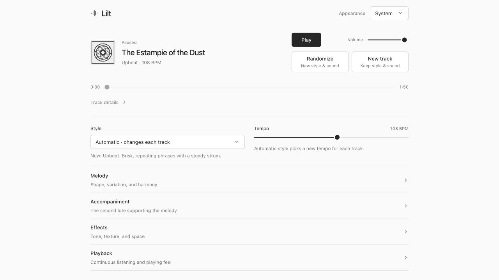

# Lilt

Lilt composes and plays lute duets in the browser. Every note is synthesized
locally using Karplus-Strong synthesis. There are no recorded instrument samples
or remote generation services.



## How Karplus-Strong works

Karplus-Strong turns a short burst of noise into the sound of a plucked string.

1. Fill a short audio buffer with noise. This is the initial pluck.
2. Read the buffer in a loop. Its length sets the approximate pitch: a shorter
   loop produces a higher note, and a longer loop produces a lower one.
3. Smooth and slightly reduce the signal each time it passes through the loop.
   Write the result back into the buffer and keep going.

The repetition gives the noise a pitch. Smoothing removes high frequencies,
while the reduction makes the note fade. The result starts bright and becomes
softer and quieter, like a vibrating string losing energy.

The starting buffer length is roughly `sample rate / frequency`. At 44,100 samples
per second, a 440 Hz note needs about 100 samples. The implementation also adjusts
the length for the delay introduced by the smoothing filter.

## How Lilt creates a lute sound

The basic loop produces a plucked string sound. Several additions give it the
character of a lute:

- **Paired strings.** Each note uses two strings, forming a course. They have
  slightly different tuning and separate noise patterns, creating a gentle
  shimmer when mixed together.
- **Pluck position.** The renderer subtracts a shifted copy of the initial noise.
  The offset represents where the string is plucked and changes which harmonics
  stand out.
- **Brightness and decay.** Filtering shapes both the initial noise and the
  feedback loop, controlling the sharpness of the attack and the loss of energy.
- **Body resonance.** Two resonant filters emphasize selected frequencies to
  suggest the wooden body around the strings.
- **Playing feel.** Chord notes can start a few milliseconds apart to create a
  strum. Notes ring through rests and overlap later plucks. Natural timing adds
  small changes in timing, note length, and volume.

Renaissance lute, gittern, and oud profiles use the same string model with
different settings for tuning, pluck position, brightness, decay, and resonance.
Effects such as reverb and echo are applied afterward.

The string model lives in
[procedural-lute.ts](src/audio/synthesis/procedural-lute.ts). Strumming lives in
[lute-performance.ts](src/audio/synthesis/lute-performance.ts), and note timing
and sustain live in [event-renderer.ts](src/audio/synthesis/event-renderer.ts).

## Run locally

Use the latest Node.js release and npm.

```sh
npm ci
npm run dev
```

Open http://127.0.0.1:5174 and press **Play**.

`npm run build` creates a production build in `dist/`.
`npm run verify` runs the tests and project checks.
